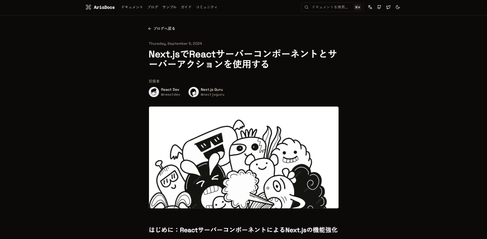

## AriaDocs - Documentation Template

This feature-packed documentation template, built with Next.js, offers a sleek and responsive design, perfect for all your project documentation needs.

<br/>

### Quick Start

You can create a new Ariadocs project using the command:

```plaintext
npx create-aria-doc <project-directory>
```

### Expected Output

When you run the CLI, you can expect an output similar to this:

```
Creating a new Ariadocs project in /path/to/your/project from the master branch...
Cloning Master (Full Documentation)...
Ariadocs project successfully created in /path/to/your/project!

Next steps:
1. Navigate to your project directory:
   cd <project-directory>
2. Install dependencies:
   // To support React 19, package maintainers will need to test and update their packages to include React 19 as a peer dependency. This is already in progress.
   npm install --force 
3. Start the development server:
   npm run dev
```

## Getting Started

First, run the development server:

```plaintext
npm run dev
# or
yarn dev
# or
pnpm dev
# or
bun dev
```


## Deploy on Vercel

The easiest way to deploy your Next.js app is to use the [Vercel Platform](https://vercel.com/new?utm_medium=default-template&filter=next.js&utm_source=create-next-app&utm_campaign=create-next-app-readme) from the creators of Next.js.

Check out our [Next.js deployment documentation](https://nextjs.org/docs/deployment) for more details.

[](https://vercel.com/new/clone?repository-url=https://github.com/nisabmohd/Aria-Docs)

## Key Features

| **Feature**                   | **Description**                                          |
|-------------------------------|----------------------------------------------------------|
| MDX Support                   | Write interactive documentation with MDX.                |
| Nested Pages                  | Organize content in a nested, hierarchical structure.    |
| Blog Section                  | Include a dedicated blog section.                        |
| Table of Contents             | Auto-generated TOC for easy navigation.                  |
| Pagination                    | Split content across multiple pages.                     |
| Syntax Highlighting           | Highlight code for better readability.                   |
| Code Line Highlighting & Titles | Highlight specific lines with descriptive titles.      |
| Interactive Code Blocks       | Language-specific and interactive code display.          |
| Custom Components             | Embed custom, reusable components in your docs.          |
| Light & Dark Mode             | Toggle between light and dark themes.                    |
| Search Functionality          | Quickly find content with a built-in search.             |
| Code Switcher                 | Switch between code languages or variations.             |
| Code Copy                     | Copy code blocks with a single click.                    |
| TOC Observer Highlight        | Highlight active sections in the TOC as you scroll.      |
| Static Site Generation        | Generate a static, high-performance site.                |
| SEO-Optimized                 | Structured for optimal search engine indexing.           |
| Internationalisation               | Added support for i18n for multiple languages |



