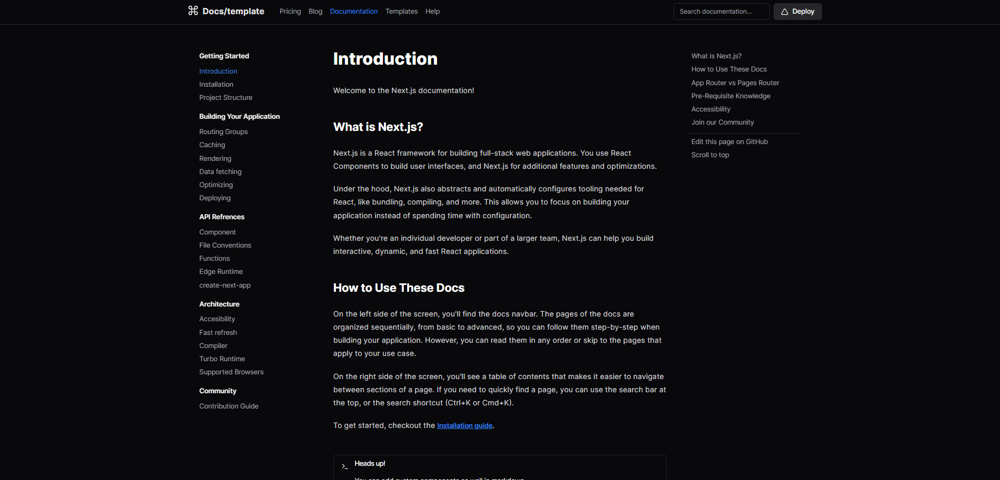
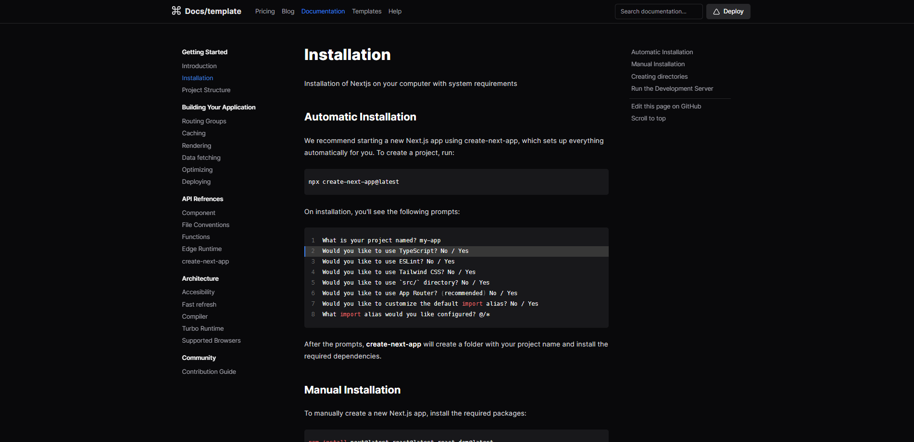
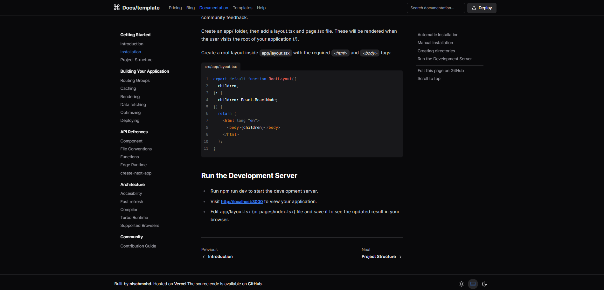
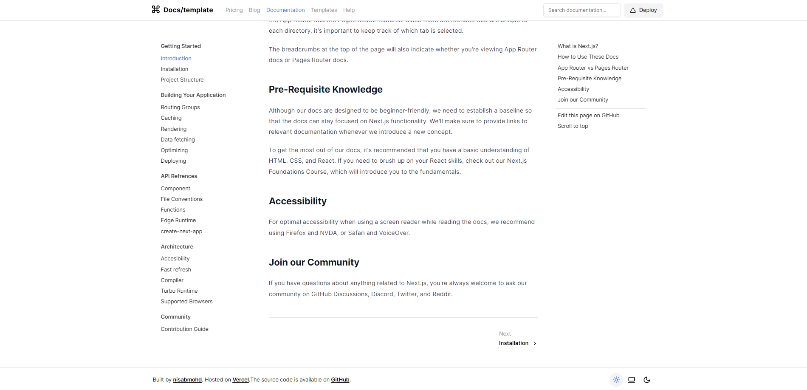

## Docs Stater Template

The "docs-starter-template" is a documentation starter kit that combines stunning design with powerful functionality, making it the perfect choice for creating polished and feature-rich project documentation. Key features include:

- **Stunning Shadcn UI**: Impress your users with a visually appealing and modern design.
- **Table of Contents**: Effortlessly navigate through your documentation with a built-in table of contents.
- **Syntax Highlighting**: Enhance code clarity and readability with syntax highlighting.
- **Line Highlighting**: Emphasize important code sections with line highlighting.
- **Code File Names**: Display code file names seamlessly within your documentation.
- **Light & Dark Mode**: Customize the appearance of your documentation with light and dark mode options.
- **Effortless Search**: Quickly find what you need with a robust search feature.
- **MDX-Powered**: All content is sourced from MDX files, enabling easy content management.
- **Next-mdx-remote**: Seamlessly compile MDX files for a smooth documentation-building process.
- **Custom Components**: Enhance your documentation with custom components integrated into MDX.
- **Next.js 13**: Enjoy blazing-fast performance and the latest Next.js features.
- **React Server & Client Components**: Add dynamic interactivity to your documentation with React components.
- **Rehype Plugins**: Utilize Rehype plugins for advanced content processing and formatting.

Create documentation that not only informs but also captivates your audience with the "docs-starter-template."

